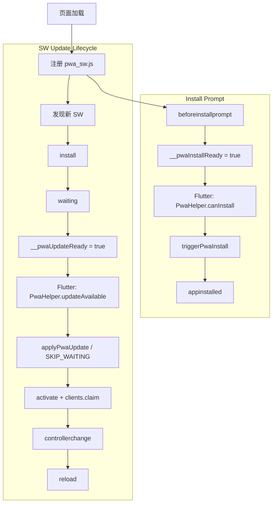

# JoyMini 企业级 PWA 缓存策略说明

## 目标

本说明用于约束 Flutter Web 的 PWA 缓存行为，平衡三件事：

1. 首屏和二次访问速度
2. 业务数据实时性（价格、库存、订单、用户态）
3. 版本更新可控（可感知、可回滚）

适用范围：

- `web/pwa_sw.js`
- `web/index.html`
- 网关/CDN 的 HTTP 缓存响应头

## 一图掌握核心（先记这 3 件事）

1. **Install 提示**解决的是“能不能安装到桌面”（`beforeinstallprompt`）。
2. **Update 提示**解决的是“有没有新版本等待激活”（`registration.waiting` / `__pwaUpdateReady`）。
3. **SW 生命周期**决定“新版本何时接管页面”（`install -> waiting -> activate -> controllerchange`）。

只要把这三条串起来，PWA 的大多数问题都能快速定位。

## 状态机流程图（Install / Update / SW 生命周期）

核心理解：

- Install 分支回答“**能不能安装**”。
- Update 分支回答“**要不要切到新版本**”。
- 两者并行存在，共享同一个页面壳，但事件源不同、职责不同。

## 生命周期、安装提示、更新提示怎么串起来

### 1) 安装链路（Install Prompt）

- 浏览器触发 `beforeinstallprompt`。
- `web/index.html` 把事件存到 `deferredPrompt`，并置 `window.__pwaInstallReady = true`。
- Flutter 侧 `PwaHelper.canInstall` 读取该标记，决定是否展示安装入口。
- 用户点击安装后调用 `window.triggerPwaInstall()`。
- 安装成功触发 `appinstalled`，前端可记录已安装状态并隐藏安装提示。

一句话：**Install 提示是浏览器授权能力，不是 SW 更新能力。**

### 2) 更新链路（Update Prompt）

- 页面注册 `pwa_sw.js` 后，浏览器发现新 SW 文件会进入 `updatefound`。
- 新 worker 安装完成后进入 `waiting`（旧页面还在被旧 worker 控制）。
- `web/index.html` 将 `window.__pwaUpdateReady` 置为 `true`，Flutter 可展示“新版本可用”提示。
- 用户点击更新后调用 `window.applyPwaUpdate()`，向 waiting worker 发送 `SKIP_WAITING`。
- 新 worker `activate`，页面收到 `controllerchange`，再刷新使新版本完全生效。

一句话：**Update 提示的本质是“有 waiting worker，等你同意切换”。**

### 3) 两条提示之间的关系

- Install 提示和 Update 提示都在 `index.html` 暴露给 Flutter，但**来源不同**：
  - Install 来自 `beforeinstallprompt`（浏览器安装能力）
  - Update 来自 SW waiting 状态（版本生命周期）
- 两者可以同时出现，但不冲突：
  - “可安装”不代表“有更新”
  - “有更新”也不依赖“是否已安装为桌面应用”

## 当前项目事件映射（与代码对齐）

| 目标 | 浏览器事件/状态 | `index.html` 暴露 | Flutter 读取/调用 |
|---|---|---|---|
| 显示安装提示 | `beforeinstallprompt` | `__pwaInstallReady` | `PwaHelper.canInstall` |
| 触发安装 | `deferredPrompt.prompt()` | `triggerPwaInstall()` | `PwaHelper.promptInstall()` |
| 显示更新提示 | `registration.waiting` / `updatefound` | `__pwaUpdateReady` | `PwaHelper.updateAvailable` |
| 手动检查更新 | `registration.update()` | `forcePwaUpdateCheck()` | `PwaHelper.checkForUpdate()` |
| 应用更新 | waiting worker + `SKIP_WAITING` | `applyPwaUpdate()` | `PwaHelper.applyUpdate()` |

## 常见误区（掌握核心后可避免）

1. 误把 Install 当 Update：安装成功不等于版本已更新。
2. 只 reload 不 skipWaiting：页面可能继续被旧 worker 控制。
3. API 被 SW 缓存：会出现“切页不发请求、手刷才更新”的假象。
4. 没有 `controllerchange` 兜底：更新提示点了但用户看不到变化。

## 推荐提示优先级（产品层）

1. **更新提示优先**：有 waiting worker 时优先提示更新，保证版本一致性。
2. **安装提示次之**：仅在可安装且未安装时展示，避免打扰。
3. **同屏冲突时**：先引导更新，再展示安装入口。

## 分层策略（企业推荐基线）

| 资源类型 | 典型路径 | 策略 | 说明 |
|---|---|---|---|
| App Shell | `/`, `/offline.html`, 图标 | cache-first | 保障离线兜底与启动稳定性 |
| Flutter 构建产物 | `main.dart.js` 等 | 交由 Flutter 默认 SW 管理 | 避免自定义 SW 重复干预 |
| 业务 API | `/api/*`, `api.joyminis.com` | network-only + `no-store` | 禁止 SW 缓存，避免陈旧业务态 |
| 内容图片（CDN） | 商品图、Banner 图 | stale-while-revalidate | 先快显，再后台更新 |
| 导航请求 | 页面跳转 | network-first + offline fallback | 在线优先，离线回 `offline.html` |

## 必须遵守的红线

1. 不允许对 API 响应做 cache-first。
2. 支付、订单、库存、秒杀等接口必须是 network-only。
3. 不在页面层拼接 SW 缓存逻辑，统一在 SW 中治理。
4. 图片缓存必须有容量上限，避免 Cache Storage 无边界增长。

## 版本更新建议

- SW `install` 后执行 `skipWaiting()`，`activate` 后 `clients.claim()`。
- 前端检测 `registration.waiting` 后提示用户更新。
- 用户确认更新时向 waiting worker 发送 `SKIP_WAITING`。
- 监听 `controllerchange` 后刷新页面，确保新 SW 生效。

## 图片缓存建议（可落地参数）

- 白名单域名：仅缓存可信域名（如当前站点 + CDN 域名）。
- 缓存策略：stale-while-revalidate。
- 建议上限：200 条（可按业务体量调 100~500）。
- 命中条件：`GET` 且 `response.ok`。

## 服务端响应头建议

- API：`Cache-Control: no-store, no-cache, must-revalidate`
- 静态图：可用 `Cache-Control: public, max-age=...`（由 CDN 控制）
- HTML：建议短缓存或 no-cache，避免旧壳滞留

## 验证清单（上线前）

1. DevTools -> Service Workers：确认 `pwa_sw.js` 已激活。
2. Network 切页时检查 API：应持续发起网络请求。
3. Application -> Cache Storage：图片缓存数量受控，不持续膨胀。
4. 断网访问：导航请求可落到 `offline.html`。
5. 发布新版本：`controllerchange` 后可完成更新切换。
6. 安装链路：`beforeinstallprompt -> triggerPwaInstall -> appinstalled` 可完整触发。

## 失败回滚策略

1. 提升 `CACHE_NAME` 版本号，快速隔离异常缓存。
2. 临时关闭图片缓存分支（保留 API network-only）。
3. 保持 `offline.html` 可访问，避免全量白屏。

