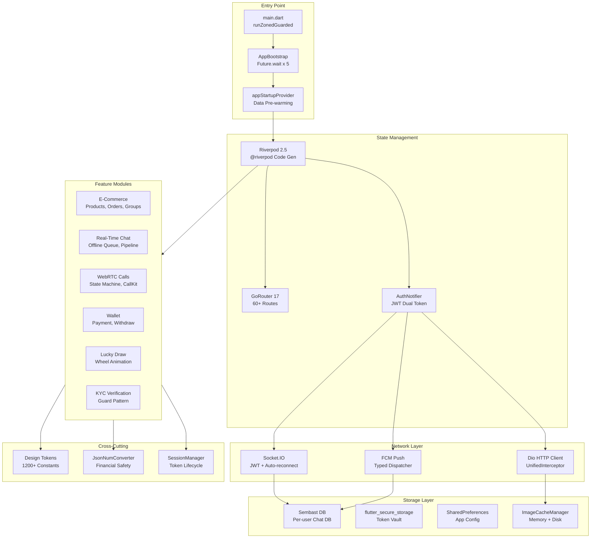

# 🎯 JoyMini — Cross-Platform E-Commerce & Social App

<p align="center">
  
  
  
  
  
  
  
  
  
  
  
  
  
  
  
  
  
  
  
  
</p>

<p align="center">
  <b>A production-grade Flutter application combining e-commerce marketplace, real-time social chat, WebRTC voice/video calling, gamified lucky draws, and financial wallet — all in one cross-platform codebase.</b>
</p>

---

## 📋 Table of Contents

- [Overview](#-overview)
- [Developer Portfolio](#-developer-portfolio)
- [Technical Challenges & Solutions](#-technical-challenges--solutions)
- [System Architecture](#-system-architecture)
- [Tech Stack](#-tech-stack)
- [Project Structure](#-project-structure)
- [Quick Start](#-quick-start)
- [Available Commands](#-available-commands)
- [Key Features](#-key-features)
- [Testing](#-testing)
- [Documentation](#-documentation)
- [My Role](#-my-role)
- [Other Projects](#-other-projects)
- [License](#-license)

---

## ✨ Overview

**JoyMini** is a full-featured cross-platform application built entirely with Flutter, targeting **6 platforms** (iOS, Android, Web, macOS, Linux, Windows) from a single Dart codebase. It serves as both an **e-commerce marketplace** for limited-edition treasure items and a **social platform** with real-time chat, group management, and WebRTC-based voice/video calling.

The project demonstrates deep expertise in:

- **Riverpod 2.5** state management with code generation (`@riverpod` annotations)
- **GoRouter 17** declarative routing with auth guards, ShellRoute tab navigation, and deep link handling (60+ routes)
- **Socket.IO** real-time communication with JWT-based session management and auto-reconnect
- **WebRTC** peer-to-peer voice/video calls with ICE restart, CallKit integration, and Android VP8 fallback
- **Offline-first architecture** using Sembast local database with message queue and exponential backoff retry
- **Custom 4-tier image cache** (Memory → Disk → CDN → Origin) with LRU eviction and Web-safe fallbacks
- **OAuth 2.0** unified authentication (Google, Facebook, Apple) via backend Deep Link flow across all platforms
- **Design token system** — 1200+ compile-time safe constants generated from a JSON design specification
- **Financial data safety** — `JsonNumConverter` pattern preventing floating-point precision loss in wallet/payment operations

---

## 👤 Developer Portfolio

<p>
  <b>Porter</b> · <a href="https://github.com/MrBigPorter">github.com/MrBigPorter</a> · <a href="https://blog.joymins.com">blog</a>
</p>

**Senior Full-Stack Engineer** with 10+ years of experience architecting and building production-grade applications across the entire stack. This Flutter project is one of two major portfolio projects — see the companion [**LJoyMini_Flutter_App**](https://github.com/MrBigPorter/JoyMini_Flutter_App) for the full-stack web counterpart.

### Full-Stack Capabilities

| Layer | Technologies |
|-------|-------------|
| **Frontend (Web)** | React 19, Next.js 15, TypeScript 5.5, Tailwind CSS 4, Zustand, TanStack Query, Framer Motion |
| **Backend** | Node.js, NestJS 11, REST API, WebSocket, Socket.IO, JWT, OAuth 2.0, Passport |
| **Database** | PostgreSQL 16, Prisma 6 ORM, Redis, BullMQ, Database Design, Migration Management |
| **Mobile** | Flutter 3.29, Dart 3.7, Capacitor 6, PWA, iOS/Android/Web/macOS/Linux/Windows |
| **DevOps** | Docker, Docker Compose, GitHub Actions, GitLab CI, Nginx, Cloudflare (Pages/Workers/KV), VPS, Linux |
| **Testing** | Vitest, Jest, Playwright, Flutter Test, Lighthouse CI |
| **Architecture** | Monorepo (Turborepo + Yarn 4), Microservices, Event-Driven, Offline-First |
| **Cloud & Services** | Cloudflare, AWS (Rekognition, S3), Firebase (FCM, Auth), Sentry, Google Gemini AI |

---

## 🧠 Technical Challenges & Solutions

### 1. 🚀 App Startup Optimization — Eliminating the White Screen Gap

**Problem:** Flutter apps typically suffer from a white screen between the native splash and the first rendered frame. With Firebase initialization, database setup, and API configuration loading sequentially, this gap could exceed 3-5 seconds on slow networks.

**Solution:** A three-phase parallel initialization architecture with a **data barrier pattern**:

```dart
// main.dart — Three-phase startup with data barrier
void main() {
  runZonedGuarded(() async {
    WidgetsFlutterBinding.ensureInitialized();

    // Phase 1: System-level parallel init (all independent)
    await AppBootstrap.initSystem();
    // Internally uses Future.wait for 5 parallel tasks:
    //   AssetManager.init(), EasyLocalization.ensureInitialized(),
    //   ApiCacheManager.init(), Http.init(), _setupFirebase()

    // Phase 2: Load persisted state (token, theme)
    final overrides = await AppBootstrap.loadInitialOverrides();

    // Phase 3: Create ProviderContainer BEFORE runApp
    final container = ProviderContainer(overrides: overrides);
    AppBootstrap.setupInterceptors(container);

    // Data barrier: block runApp until critical data is ready
    await container.read(appStartupProvider.future);

    // Zero white screen — runApp with fully hydrated state
    runApp(UncontrolledProviderScope(
      container: container,
      child: EasyLocalization(/* ... */),
    ));
  }, (error, stack) { /* global catch-all */ });
}
```

**Key Details:**
- `Future.wait` runs 5 independent system tasks concurrently — total wall time = slowest task, not sum
- `ProviderContainer` created before `runApp` enables data pre-warming (DB init, contact/conversation fetch)
- Firebase initialization has a **10-second timeout guard** — app works without Firebase
- Dirty token data auto-cleaning: if token exists but user info is missing, both are wiped
- `GlobalOAuthHandler` injected with `ProviderContainer` reference, surviving page destruction

---

### 2. 🖼️ Custom 4-Tier Image Cache — Eliminating Redundant Network Requests

**Problem:** The app displays hundreds of product images, user avatars, and banner ads. Without caching, every page navigation triggers network requests, wasting bandwidth and causing visible loading spinners. Flutter's built-in `ImageCache` is memory-only and platform-inconsistent.

**Solution:** A singleton-managed 4-tier cache with LRU eviction, thread-safe access, and Web-safe fallbacks:

```dart
class ImageCacheManager {
  static final ImageCacheManager _instance = ImageCacheManager._internal();

  // L1: Memory cache (LRU, max 100 items / 100MB)
  final _memoryCache = <String, _MemoryCacheEntry>{};
  final _memoryCacheLock = Lock(); // Thread-safe concurrent access

  // L2: Disk cache (7-day stale period, 200 objects, native only)
  CacheManager? _diskCacheManager;

  Future<Uint8List> getImageData(String url, {bool skipMemoryCache = false}) async {
    _totalRequestCount++;

    // L1: Memory hit → return instantly
    if (!skipMemoryCache) {
      final memoryData = await _getFromMemoryCache(url);
      if (memoryData != null) { _memoryHitCount++; return memoryData; }
    }

    // L2: Disk hit → promote to memory, return
    if (!kIsWeb && !skipDiskCache) {
      final diskData = await _getFromDiskCache(url);
      if (diskData != null) { _diskHitCount++; _setToMemoryCache(url, diskData); return diskData; }
    }

    // L3/L4: Network fetch → populate both caches
    final networkData = await _fetchFromNetwork(url);
    if (!kIsWeb) unawaited(_setToDiskCache(url, networkData));
    _setToMemoryCache(url, networkData);
    return networkData;
  }
}
```

**Key Details:**
- **Web isolation:** Disk cache (`path_provider`) disabled on Web to prevent runtime crashes
- **HTML response detection:** Catches CDN error pages (e.g., Cloudflare HTML) and degrades gracefully instead of crashing
- **Small image tolerance:** Fixed a bug where legitimate icons <50 bytes were rejected
- **Performance monitoring:** Tracks memory/disk hit rates for optimization decisions
- **LRU eviction:** Sorts by `lastAccessTime`, removes oldest entry when cache is full

---

### 3. 🔐 OAuth Deep Link Flow — Unified Authentication Across 3 Platforms

**Problem:** Google, Facebook, and Apple each have different native SDKs, Web flows, and platform restrictions. Apple requires Sign-In with Apple on iOS/macOS. Web OAuth needs full-page redirects. Mobile needs WebView. All three must produce the same JWT token format.

**Solution:** A backend-driven Deep Link OAuth system with a unified frontend service:

```dart
class DeepLinkOAuthService {
  // Single entry point for all providers
  static Future<Map<String, String>> loginWithGoogle({/* ... */}) =>
      _loginWithProvider('google', apiBaseUrl, ...);
  static Future<Map<String, String>> loginWithFacebook({/* ... */}) =>
      _loginWithProvider('facebook', apiBaseUrl, ...);
  static Future<Map<String, String>> loginWithApple({/* ... */}) =>
      _loginWithProvider('apple', apiBaseUrl, ...);

  // CSRF protection: 32-byte random state
  static String _generateState() {
    final random = Random.secure();
    final bytes = List<int>.generate(32, (_) => random.nextInt(256));
    return base64Url.encode(bytes).replaceAll('=', '');
  }

  // Platform-aware routing
  static Future<Map<String, String>> _loginWithProvider(
    String provider, String apiBaseUrl, {BuildContext? context}
  ) async {
    if (kIsWeb) return _webLoginWithProvider(provider, apiBaseUrl);
    return _mobileLoginWithProvider(provider, apiBaseUrl, context: context);
  }
}
```

**Key Details:**
- **Web:** Full-page redirect with `sessionStorage` state parameter for CSRF protection
- **Mobile:** `OAuthWebViewPage` using official `webview_flutter` (iOS 26+ compatible)
- **Deep link listener:** `app_links` package listens for `joymini://oauth/callback` on all platforms
- **Apple Sign-In** is platform-gated: only shown on iOS, macOS, and Web
- **GlobalOAuthHandler** survives page destruction by using a global `ProviderContainer` reference
- Token is returned via `Navigator.pop()` in WebView, with OS-level deep link as safety net

---

### 4. 💬 Real-Time Chat with WebRTC Calls — Offline-First Architecture

**Problem:** Users expect instant message delivery and voice/video calls. Network interruptions are common on mobile. Messages sent offline must not be lost. WebRTC calls must work across iOS/Android/Web with different codec support.

**Solution:** A Socket.IO real-time layer + Sembast offline queue + WebRTC with platform-specific codec negotiation:

```dart
// SocketService — Centralized event dispatch with modular mixins
class SocketService extends _SocketBase
    with SocketDispatcherMixin, SocketChatMixin,
         SocketContactMixin, SocketNotificationMixin, SocketLobbyMixin {
  // JWT-authenticated connection with auto-reconnect
  Future<void> init({required String token, TokenRefreshCallback? onTokenRefresh}) async {
    // Validates token, creates IO.Socket, registers 20+ event handlers
  }
}

// OfflineQueueManager — Exponential backoff retry
class OfflineQueueManager {
  static const int maxRetries = 5;
  final Map<String, int> _retryRegistry = {};

  Future<void> _doFlush() async {
    final pendingMessages = await LocalDatabaseService().getPendingMessages();
    for (var msg in pendingMessages) {
      if (_retryRegistry[msg.id]! >= maxRetries) {
        await LocalDatabaseService().updateMessageStatus(msg.id, MessageStatus.failed);
        continue;
      }
      bool success = await _resendViaPipeline(msg);
      if (!success) _retryRegistry[msg.id] = (_retryRegistry[msg.id] ?? 0) + 1;
      await Future.delayed(const Duration(milliseconds: 500)); // Throttle
    }
  }
}
```

**WebRTC Call State Machine (636 lines):**

```dart
class CallStateMachine extends StateNotifier<CallState> {
  final MediaManager _media = MediaManager();
  final WebRTCManager _webrtc = WebRTCManager();

  Future<void> startCall(String targetId, {bool isVideo = true}) async {
    // 1. Configure audio session (speaker/earpiece routing)
    await _media.configureAudioSession(isVideo, () => state.isMuted);
    // 2. Initialize local/remote video renderers in parallel
    await Future.wait([localRenderer.initialize(), remoteRenderer.initialize()]);
    // 3. Create PeerConnection with STUN/TURN
    await _webrtc.createConnection(_media.localStream);
    // 4. Generate SDP offer and emit via signaling
    final sdp = await _webrtc.createOfferAndSetLocal();
    _signaling.emitInvite(sessionId: sessionId, targetId: targetId, sdp: sdp, isVideo: isVideo);
  }
}
```

**Key Details:**
- **Socket.IO** with JWT auth, auto-reconnect, and 20+ event types dispatched via mixin pattern
- **Offline queue:** Sembast stores pending messages, retries with 500ms throttle, max 5 retries, auto-flushes on network restore
- **WebRTCManager:** ICE candidate queue (candidates queued until remote description is set), VP8 forced on Android (H264 disabled for compatibility)
- **CallKitService:** iOS native call UI integration, AirPods accidental hang-up interception
- **ICE restart** supported via renegotiation on the invite channel
- **Chat pipeline:** `PersistStep → RecoverStep → VideoProcessStep` with BlurHash generation for smooth image transitions
- **LocalDatabaseService:** Per-user Sembast database, message deduplication, unread badge sync, Web blob URL cleanup

---

### 5. 💰 Financial Data Safety — Preventing Floating-Point Catastrophe

**Problem:** JSON deserialization in Dart can silently convert `"99.99"` (String) to `null` or corrupt numeric precision. A single `double.parse(null)` crash in a wallet transaction could lose user funds.

**Solution:** A centralized `JsonNumConverter` enforced across all financial models:

```dart
class JsonNumConverter {
  /// Safe double extraction — handles null, num, String, and malformed input
  static double toDouble(dynamic val) {
    if (val == null) return 0.0;
    if (val is num) return val.toDouble();     // int/double → safe
    if (val is String) return double.tryParse(val) ?? 0.0;  // "99.99" → safe
    return 0.0;  // Fallback: never crash
  }

  static int toInt(dynamic val) {
    if (val == null) return 0;
    if (val is num) return val.toInt();
    if (val is String) return int.tryParse(val) ?? 0;
    return 0;
  }
}

// Usage in payment models:
final amount = JsonNumConverter.toDouble(json['amount']);
final entries = JsonNumConverter.toInt(json['entries']);
```

**Key Details:**
- Used across all wallet, payment, order, and lucky draw models
- Eliminates `double.parse()` crashes from malformed API responses
- `toDoubleOrNull` variant available for optional fields
- Enforced by `.clinerules` as a project-wide convention

---

### 6. 🎡 Lucky Draw Spinning Wheel — Complex Animation State Machine

**Problem:** The lucky draw wheel needs to feel fair and exciting. The result must be server-confirmed before animation starts (preventing client-side cheating). The animation must land precisely on the correct prize segment with a dramatic spinning effect.

**Solution:** A 5-stage state machine with server-first result confirmation and a custom `AnimationController`:

```dart
enum _LuckyDrawWheelStage { ready, requesting, landing, completed, failed }

// Server-first: result is confirmed BEFORE animation starts
Future<void> _startDraw() async {
  setState(() => _stage = _LuckyDrawWheelStage.requesting);

  // Step 1: Request result from server (blocking)
  final result = await ref.read(luckyDrawActionProvider.notifier).draw(ticketId);
  if (result == null) { setState(() => _stage = _LuckyDrawWheelStage.failed); return; }

  // Step 2: Result confirmed — now animate the wheel
  setState(() { _stage = _LuckyDrawWheelStage.landing; _result = result; });
  _resultStream.add(result); // Triggers wheel animation
}

// Animation: 8-11 random spins + easeOutCubic deceleration
void _onResult(LuckyDrawActionResult result) {
  final spins = 8 + _random.nextInt(4); // 8-11 full rotations
  final targetAngle = (prizeIndex * anglePerPrize) + randomOffset;
  final finalAngle = (spins * 2 * pi) - targetAngle - (pi / totalPrizes);

  _resultController = AnimationController(
    vsync: this, duration: const Duration(milliseconds: 5500),
  );
  final animation = Tween<double>(begin: currentRotation, end: finalAngle)
      .animate(CurvedAnimation(parent: _resultController!, curve: Curves.easeOutCubic));
  _resultController!.forward();

  // Safety net: force-complete after 7 seconds
  Future.delayed(const Duration(seconds: 7), () {
    if (_resultController?.isAnimating == true) {
      _resultController?.stop();
      widget.onAnimationEnd(result);
    }
  });
}
```

**Key Details:**
- **Server-first integrity:** API call completes before any animation begins — prevents client-side manipulation
- **8-11 random full spins** with `easeOutCubic` curve for dramatic deceleration effect
- **Custom `_WheelPainter`** draws 8 alternating prize segments with icons and labels
- **7-second animation timeout** prevents the wheel from spinning indefinitely on low-end devices
- **`PopScope`** blocks navigation during the draw to prevent state corruption
- **Constellation background** (`CustomPainter` with 60 random stars) adds visual polish
- **1374 lines** of dedicated wheel UI code — the most complex single widget in the app

---

### 7. 🎨 Design Token System — From JSON to Compile-Time Safe Constants

**Problem:** Designers update colors, spacing, and typography in Figma. Manually syncing these values across 100+ widgets is error-prone. Hardcoded colors lead to visual inconsistency.

**Solution:** A code generation pipeline that transforms `variables.tokens.json` into compile-time safe Dart constants:

```dart
// GENERATED CODE — DO NOT MODIFY BY HAND
// Source: assets/variables.tokens.json
class TokensLight {
  static const Color textPrimary900 = Color(0xff181d27);
  static const Color textSecondary700 = Color(0xff414651);
  static const Color textBrandSecondary700 = Color(0xffe04f16);
  static const Color bgBrandSolid = Color(0xfffc7701);
  static const Color bgErrorSolid = Color(0xffd92d20);
  static const Color bgWarningSolid = Color(0xffeaaa08);
  static const Color bgSuccessSolid = Color(0xff079455);
  // ... 1200+ total constants (colors, shadows, spacing, typography)
}
```

**Key Details:**
- **1214 lines** of generated Dart code from a single JSON source
- Generator script: [`tool/gen_tokens_flutter.dart`](tool/gen_tokens_flutter.dart)
- Light theme only (dark theme values derived from the same token set)
- Integrated with `flutter_screenutil` for responsive sizing
- Enforced by `.clinerules`: "禁止硬编码颜色/尺寸，使用生成的设计令牌"

---

### 8. 🔄 HTTP Client & Token Refresh — Race-Condition-Safe JWT Lifecycle

**Problem:** JWT access tokens expire every 15 minutes. Multiple concurrent API calls could all trigger token refresh simultaneously, causing race conditions. A failed refresh must gracefully log out without crashing.

**Solution:** A `UnifiedInterceptor` with a token refresh lock and retry mechanism:

```dart
class UnifiedInterceptor extends QueuedInterceptor {
  @override
  void onRequest(RequestOptions options, RequestInterceptorHandler handler) async {
    // Inject device fingerprint headers
    options.headers['x-device-id'] = fingerprint.deviceId;
    options.headers['x-device-model'] = fingerprint.deviceModel;
    options.headers['x-platform'] = fingerprint.platform;

    // Inject JWT token
    final token = await Http.getToken();
    if (token != null) options.headers['Authorization'] = 'Bearer $token';
    handler.next(options);
  }

  @override
  void onResponse(Response response, ResponseInterceptorHandler handler) async {
    final strategy = ErrorConfig.getStrategy(response.data['code']);
    switch (strategy) {
      case ErrorStrategy.refresh:
        await _handleTokenRefresh(response, handler);  // Auto-refresh + retry
        break;
      case ErrorStrategy.security:
        EventBus().emit(GlobalEvent(GlobalEventType.deviceBanned));
        handler.reject(_asDioError(response, 'Security Block'));
        break;
      case ErrorStrategy.redirect:
        _handleRedirect(code);  // Route to KYC/settings/bind-phone
        break;
    }
  }
}
```

**SessionManager** proactively refreshes tokens 2 minutes before expiry:

```dart
class SessionManager extends WidgetsBindingObserver {
  Future<void> _scheduleNextRefresh() async {
    final token = await Http.getToken();
    final remaining = JwtDecoder.getRemainingTime(token);
    final secondsToWait = remaining.inSeconds - 120; // 2 minutes before expiry

    _refreshTimer = Timer(Duration(seconds: secondsToWait), () async {
      await _performSilentRefresh(); // Refresh + reconnect socket
    });
  }
}
```

**Key Details:**
- **QueuedInterceptor** serializes concurrent refresh attempts — only one refresh runs at a time
- **Error strategy pattern:** 5 strategies (success, refresh, security, redirect, toast) mapped from server error codes
- **Server time calibration:** `ServerTimeHelper.updateOffset()` syncs client clock from response headers
- **Auto-logout** on refresh failure with clean state reset (DB close, token clear, route to home)
- **SessionManager** is a `keepAlive: true` Riverpod provider — lives for the entire app session
- App lifecycle observer triggers token check on foreground resume

---

### 9. 📱 FCM Push Notification Architecture — Typed Dispatcher Pattern

**Problem:** Firebase Cloud Messaging delivers notifications in three contexts (cold start, background, foreground). Each notification type (chat message, group invite, lucky draw win, system alert) needs different handling. Some need CallKit integration.

**Solution:** A typed dispatcher pattern with specialized handlers:

```dart
class FcmDispatcher {
  final Map<String, BaseHandler> _handlers = {
    'chat': ChatHandler(),
    'group': GroupHandler(),
    'lucky_draw': LuckyDrawHandler(),
    'system': SystemHandler(),
  };

  void dispatch(RemoteMessage message, {required bool isInteraction}) {
    final type = message.data['type']?.toString() ?? 'system';
    final handler = _handlers[type] ?? _handlers['system']!;
    handler.handle(message.data, isInteraction: isInteraction);
  }
}

// Background handler (registered at native level)
@pragma('vm:entry-point')
Future<void> firebaseMessagingBackgroundHandler(RemoteMessage message) async {
  await Firebase.initializeApp();
  await CallDispatcher.instance.dispatch(message.data); // CallKit for incoming calls
}
```

**Key Details:**
- Three listener contexts: `onMessageOpenedApp` (background tap), `onMessage` (foreground), `getInitialMessage` (cold start)
- VAPID key configured for Web push notifications
- Firebase init has 10-second timeout — app works without Firebase
- CallKit integration for incoming call notifications

---

## 🏛️ System Architecture



### Key Architectural Decisions

| Decision | Rationale |
|----------|-----------|
| **Riverpod over BLoC** | Compile-time safety, no boilerplate, `@riverpod` code generation, `keepAlive` for singletons |
| **GoRouter over Navigator 2.0 raw** | Declarative routing, auth redirects, ShellRoute for tab bars, deep link support |
| **Socket.IO over WebSocket raw** | Auto-reconnect, event-based messaging, room support, fallback to HTTP long-polling |
| **Sembast over SQLite** | No SQL schema, JSON-native, Web support via `sembast_web`, per-user database isolation |
| **Backend Deep Link OAuth over native SDKs** | Single flow for all 3 providers, no platform-specific SDK version conflicts, no App Store review for OAuth changes |
| **Custom image cache over cached_network_image** | Full control over eviction policy, Web-safe disk cache isolation, performance monitoring |
| **FVM over global Flutter** | Consistent Flutter version across team, per-project Dart/Flutter SDK pinning |

---

## 🛠️ Tech Stack

| Category | Technology | Version |
|----------|-----------|---------|
| **Framework** | Flutter | 3.29 (stable) |
| **Language** | Dart | 3.7 |
| **State Management** | Riverpod + riverpod_annotation | 2.5.x |
| **Routing** | GoRouter | 17.x |
| **HTTP Client** | Dio | 5.x |
| **Real-Time** | socket_io_client | 3.x |
| **WebRTC** | flutter_webrtc | Latest |
| **Local DB** | Sembast + sembast_web | Latest |
| **Secure Storage** | flutter_secure_storage | Latest |
| **Push Notifications** | Firebase Messaging | Latest |
| **Deep Links** | app_links | Latest |
| **i18n** | easy_localization | Latest |
| **Responsive** | flutter_screenutil | Latest |
| **Code Gen** | build_runner + riverpod_generator + json_serializable | Latest |
| **CI/Quality** | Flutter Analyze + Flutter Test | — |
| **Version Mgmt** | FVM (.fvmrc) | — |
| **Build System** | Makefile (dev/test/prod) | — |
| | **Full-Stack Portfolio** | |
| **Frontend (Web)** | React 19, Next.js 15, TypeScript 5.5, Tailwind CSS 4, Zustand, TanStack Query | — |
| **Backend** | Node.js, NestJS 11, REST API, WebSocket, Socket.IO, JWT, OAuth 2.0 | — |
| **Database** | PostgreSQL 16, Prisma 6 ORM, Redis, BullMQ | — |
| **DevOps** | Docker, GitHub Actions, GitLab CI, Cloudflare (Pages/Workers/KV), Nginx | — |
| **Testing** | Vitest, Jest, Playwright, Lighthouse CI | — |
| **Architecture** | Monorepo (Turborepo + Yarn 4), Microservices | — |

---

## 📁 Project Structure

```
lib/
├── main.dart                     # Entry point: runZonedGuarded, 3-phase startup
├── app/
│   ├── app.dart                  # MyApp widget (MaterialApp.router)
│   ├── bootstrap.dart            # System init: Future.wait x 5, token cleaning
│   ├── app_startup.dart          # Data pre-warming: DB, contacts, conversations
│   └── routes/
│       └── app_router.dart       # GoRouter: 60+ routes, auth guards, deep links
├── core/
│   ├── api/http_client.dart      # Dio wrapper with token refresh
│   ├── json/json_num_converters.dart  # Financial safety converters
│   ├── models/                   # 20+ data models with JSON serialization
│   ├── network/unified_interceptor.dart  # Auth, fingerprint, error strategy
│   ├── providers/                # 20+ Riverpod providers
│   ├── services/
│   │   ├── auth/                 # Deep Link OAuth (Google/Facebook/Apple)
│   │   ├── fcm/                  # Push notification dispatcher
│   │   └── socket/               # Socket.IO with mixin-based event dispatch
│   ├── store/
│   │   ├── auth/                 # AuthNotifier, AuthState
│   │   └── token/                # Secure token storage
│   └── guards/kyc_guard.dart     # KYC verification guard pattern
├── ui/
│   ├── chat/                     # Full chat module
│   │   ├── core/call_manager/    # WebRTC, CallKit, signaling, state machine
│   │   ├── services/database/    # Sembast local DB (570 lines)
│   │   ├── services/network/     # Offline queue manager
│   │   ├── pipeline/             # Message processing pipeline
│   │   └── models/               # Chat UI models, conversation, call events
│   ├── modal/                    # Radix modal/sheet system
│   ├── button/                   # Design system buttons
│   └── img/                      # Optimized image widgets
├── theme/
│   ├── design_tokens.g.dart      # 1214 lines of generated design tokens
│   └── theme_provider.dart       # Theme mode management
└── utils/
    ├── image/image_cache_manager.dart  # 4-tier image cache
    └── events/                   # Global event bus
```

---

## 🚀 Quick Start

### Prerequisites

- [FVM](https://fvm.app/) installed globally
- Flutter SDK (version pinned in `.fvmrc`)
- iOS: Xcode 16+, CocoaPods
- Android: Android Studio, JDK 17
- Web: Chrome

```bash
# 1. Clone the repository
git clone <repo-url>
cd flutter_happy_app

# 2. Install Flutter version via FVM
fvm install
fvm flutter pub get

# 3. Run in development mode
fvm flutter run -t lib/main.dart \
    --dart-define-from-file config/dev.env
```

---

## 📋 Available Commands

### Development

```bash
make dev        # Run in dev mode (uses config/dev.env)
make test       # Run in test mode
make prod       # Run in production mode
```

### Build & Code Generation

```bash
make gen        # Run build_runner (single build, not watch)
make clean      # Clean all build artifacts
```

### Quality

```bash
make analyze    # Static analysis (warnings treated as errors)
make test       # Run all tests
```

### Platform Fixes

```bash
make ios-fix    # Fix iOS build issues (Podfile, xcassets)
make android-fix # Fix Android build issues
```

---

## ✨ Key Features

### 🛒 E-Commerce Platform
- Product catalog with categories, flash sales, and group buying
- Order management with refund flow
- Address management
- Voucher/coupon system

### 💬 Real-Time Chat & Social
- Direct messaging with text, image, video, voice, file, and location
- Group chat with member management, roles, and QR code invites
- Contact system with friend requests and search
- Message pipeline: persist → recover → process (video compression, BlurHash)

### 📞 WebRTC Voice/Video Calls
- Peer-to-peer audio/video calls via WebRTC
- ICE restart support for network transitions
- CallKit integration for iOS native call UI
- Platform-specific codec negotiation (VP8 on Android, H264 on iOS)
- Speaker/earpiece routing with hardware change detection

### 💰 Wallet & Financial System
- Balance management with deposit/withdraw
- Transaction history with detailed records
- Payment method management
- `JsonNumConverter` enforced for all financial operations

### 🎰 Lucky Draw & Gamification
- Ticket-based lucky draw system
- Spinning wheel animation with server-confirmed results
- Prize types: coupons, coins, balance, "thanks"
- Activity coins and leaderboards

### 🔐 KYC & Identity Verification
- Multi-step KYC flow with document scanning
- Liveness detection (camera-based)
- Guard pattern: approved → callback, reviewing → pending sheet, else → verify modal
- Status tracking and re-verification

### 🌐 Cross-Platform & PWA
- 6 platforms from a single codebase
- PWA support with install prompts and offline caching
- Platform-specific adapters (HTTP adapter, image provider, file download)
- Responsive design with `flutter_screenutil`

---

## 🧪 Testing

```bash
# Static analysis (warnings treated as errors)
fvm flutter analyze

# Run all tests
fvm flutter test
```

### Testing Policy

| Type | Requirement |
|------|-------------|
| **New features** | Minimum 1 Unit test + 1 Widget test |
| **Bug fixes** | Must include regression test |
| **Coverage** | Focus on providers, models, and critical UI flows |

**Test files:** [`test/providers/`](test/providers/) (7 files), [`test/widgets/`](test/widgets/) (5 files)

---

## 📚 Documentation

| Document | Description |
|----------|-------------|
| [`docs/AI_QUICK_START.md`](docs/AI_QUICK_START.md) | Quick context for AI agents |
| [`docs/README.md`](docs/README.md) | Build & packaging guide (Chinese) |
| [`docs/FLUTTER_COMMANDS_CHEATSHEET.md`](docs/FLUTTER_COMMANDS_CHEATSHEET.md) | Command reference |
| [`docs/BUILD_TROUBLESHOOTING.md`](docs/BUILD_TROUBLESHOOTING.md) | Build issue resolution |
| [`docs/CHAT_PERFORMANCE_OPTIMIZATION_PLAN.md`](docs/CHAT_PERFORMANCE_OPTIMIZATION_PLAN.md) | Chat optimization |
| [`docs/IMAGE_OPTIMIZATION_PHASE1.md`](docs/IMAGE_OPTIMIZATION_PHASE1.md) | Image cache optimization |
| [`docs/Features & Integrations/login/`](docs/Features%20&%20Integrations/login/) | OAuth deep link implementation guides |
| [`docs/Architecture & Design/ARCHITECTURE_GUIDE.md`](docs/Architecture%20&%20Design/ARCHITECTURE_GUIDE.md) | Architecture overview |
| [`docs/Architecture & Design/ARCHITECTURE_MASTER.md`](docs/Architecture%20&%20Design/ARCHITECTURE_MASTER.md) | Master architecture document |
| [`docs/Features & Integrations/Roadmaps & Logs/PROJECT_MASTER_LOG.md`](docs/Features%20&%20Integrations/Roadmaps%20&%20Logs/PROJECT_MASTER_LOG.md) | Project master log |
| [`docs/Features & Integrations/Web & Performance/OPTIMIZATION_STATUS_REPORT.md`](docs/Features%20&%20Integrations/Web%20&%20Performance/OPTIMIZATION_STATUS_REPORT.md) | Performance optimization status |
| [`docs/Features & Integrations/Feature/Chat Service.md`](docs/Features%20&%20Integrations/Feature/Chat%20Service.md) | Chat service documentation |
| [`docs/Features & Integrations/Feature/FLUTTER_ORDER_STATUS_ALIGNMENT_CN.md`](docs/Features%20&%20Integrations/Feature/FLUTTER_ORDER_STATUS_ALIGNMENT_CN.md) | Order status alignment |
| [`docs/Features & Integrations/Feature/video Optimization.md`](docs/Features%20&%20Integrations/Feature/video%20Optimization.md) | Video optimization |
| [`docs/Features & Integrations/Web & Performance/app start analy.md`](docs/Features%20&%20Integrations/Web%20&%20Performance/app%20start%20analy.md) | App startup analysis |
| [`docs/Features & Integrations/Web & Performance/PWA_Implementation_Guide.md`](docs/Features%20&%20Integrations/Web%20&%20Performance/PWA_Implementation_Guide.md) | PWA implementation guide |
| [`docs/Features & Integrations/Web & Performance/Security & Native Bridge Protocol.md`](docs/Features%20&%20Integrations/Web%20&%20Performance/Security%20&%20Native%20Bridge%20Protocol.md) | Security & native bridge |
| [`docs/SENTRY_INTEGRATION_ANALYSIS.md`](docs/SENTRY_INTEGRATION_ANALYSIS.md) | Sentry error tracking analysis |
| [`docs/ERROR_PATTERNS.md`](docs/ERROR_PATTERNS.md) | Common error patterns |
| [`docs/ERROR_HANDLER_USAGE.md`](docs/ERROR_HANDLER_USAGE.md) | Error handler usage guide |
| [`docs/LOADING_STATE_GUIDE.md`](docs/LOADING_STATE_GUIDE.md) | Loading state management |
| [`docs/COMPREHENSIVE_OPTIMIZATION_PLAN.md`](docs/COMPREHENSIVE_OPTIMIZATION_PLAN.md) | Comprehensive optimization plan |
| [`docs/DATABASE_QUERY_OPTIMIZATION.md`](docs/DATABASE_QUERY_OPTIMIZATION.md) | Database query optimization |
| [`docs/DYNAMIC_SYSTEM_CONFIG_IMPLEMENTATION.md`](docs/DYNAMIC_SYSTEM_CONFIG_IMPLEMENTATION.md) | Dynamic system config |
| [`docs/HOME_PAGE_IMAGE_OPTIMIZATION_INTEGRATION.md`](docs/HOME_PAGE_IMAGE_OPTIMIZATION_INTEGRATION.md) | Home page image optimization |
| [`docs/AI_DOCUMENTATION_ANALYSIS.md`](docs/AI_DOCUMENTATION_ANALYSIS.md) | AI documentation analysis |
| [`docs/AI_DOCUMENTATION_IMPROVEMENTS_SUMMARY.md`](docs/AI_DOCUMENTATION_IMPROVEMENTS_SUMMARY.md) | AI documentation improvements |
| [`docs/AI_COLLABORATION_WORKFLOW.md`](docs/AI_COLLABORATION_WORKFLOW.md) | AI collaboration workflow |
| [`docs/templates/`](docs/templates/) | Reusable documentation templates |
| [`SECURITY.md`](SECURITY.md) | Security policy & vulnerability reporting |

---

## 👤 My Role

As the **sole Flutter developer** on this project, I was responsible for the entire mobile application lifecycle — from architecture design and state management to UI implementation, testing, and cross-platform deployment.

### Key Contributions

| Area | Contribution |
|------|-------------|
| **Architecture** | Designed the entire app architecture: Riverpod state management, GoRouter routing, 3-phase startup, offline-first data layer |
| **Authentication** | Implemented OAuth 2.0 deep link flow for Google/Facebook/Apple with CSRF protection and platform-aware routing |
| **Real-Time Chat** | Built Socket.IO integration with mixin-based event dispatch, offline message queue with exponential backoff retry |
| **WebRTC Calls** | Implemented peer-to-peer voice/video calls with ICE restart, CallKit integration, and platform-specific codec negotiation |
| **Image Cache** | Designed and built a custom 4-tier image cache (Memory → Disk → CDN → Origin) with LRU eviction and Web-safe fallbacks |
| **Lucky Draw** | Developed the spinning wheel animation with CustomPainter, 5-stage state machine, and server-confirmed result flow |
| **Design System** | Created the design token generation pipeline from JSON → 1200+ compile-time safe Dart constants |
| **Financial Safety** | Implemented `JsonNumConverter` pattern to prevent floating-point precision loss in all wallet/payment operations |
| **Push Notifications** | Built FCM push notification architecture with typed dispatcher pattern and CallKit integration |
| **HTTP Client** | Implemented Dio-based HTTP client with race-condition-safe token refresh and 5-strategy error handling |
| **KYC Flow** | Built multi-step KYC verification with guard pattern and liveness detection |
| **Testing** | Established testing policy (Unit + Widget per feature, regression for bugs) and wrote provider/widget tests |
| **DevOps** | Set up FVM, Makefile-based build system with dev/test/prod environments, Firebase integration, and CI/CD pipeline |

### Technical Highlights for Interviews

- **Startup Performance:** Reduced white screen time from 3-5s to near-zero using parallel initialization with `Future.wait` and data barrier pattern
- **Offline Resilience:** Built a complete offline-first chat system with Sembast local DB, message queue, and automatic retry with exponential backoff
- **Animation Engineering:** Implemented a complex spinning wheel animation with physics-based easing (`easeOutCubic`), 8-11 random spins, and server-confirmed result synchronization
- **Token Security:** Designed a race-condition-safe JWT refresh mechanism with proactive 2-minute pre-expiry refresh and app lifecycle observation
- **Cross-Platform Parity:** Solved platform-specific challenges across 6 platforms — Web image caching (no `dart:io`), iOS CallKit, Android VP8 codec, macOS/Linux/Windows desktop adapters
- **Financial Precision:** Eliminated floating-point errors in financial calculations through a custom `JsonNumConverter` pattern enforced across all wallet/payment operations
- **Push Architecture:** Built a typed dispatcher pattern for FCM push notifications that routes messages to specialized handlers based on message type
- **Code Generation Pipeline:** Created a design token generation system that transforms JSON design specs into compile-time safe Dart constants, eliminating runtime errors from hardcoded values

---

### 🖥️ Full-Stack Portfolio: Lucky Nest Monorepo

In parallel with this Flutter project, I also built a **production-grade full-stack monorepo** from scratch as the sole developer:

| Component | Technology | Key Features |
|-----------|-----------|--------------|
| [**Admin Dashboard**](https://github.com/MrBigPorter/JoyMini-Flutter-App) | Next.js 15, React 19, TypeScript | RBAC, 6-language i18n, real-time chat (Socket.IO), AI image translation (Google Gemini) |
| [**REST API**](https://github.com/MrBigPorter/JoyMini-Flutter-App) | NestJS 11, Prisma 6, PostgreSQL 16 | Dual JWT/OAuth 2.0, WebSocket IM gateway, 70+ migrations, KYC pipeline (AWS Rekognition) |
| [**Multi-Platform Blog**](https://github.com/MrBigPorter/JoyMini-Flutter-App) | Next.js 15, Capacitor 6 | PWA, Cloudflare edge (sub-200ms TTFB), iOS/Android, offline support |
| **Liveness Check** | Vite + React + AWS Rekognition | Face liveness detection, cross-origin iframe IPC |
| **Shared Packages** | TypeScript, Radix UI, ESLint | Types, constants, UI components, shared configs |

**Technical Highlights:**
- **SSR Hydration Flicker Solved** — Inline script reads localStorage before React hydrate, eliminating FOUC on theme switch
- **Race-Condition-Safe Token Refresh** — Single-fly pattern prevents concurrent 401 race conditions
- **Monorepo Docker Optimization** — Layered caching strategy for Yarn 4 PnP, reducing build time by 60%
- **Dual CI/CD Pipeline** — GitHub Actions + GitLab CI with multi-stage Docker builds and zero-downtime deployment
- **40+ Test Files** — Vitest, Jest, Playwright, Lighthouse CI performance budgets (LCP < 2.5s, CLS < 0.1)

> **GitHub:** [https://github.com/MrBigPorter/JoyMini_Nest_Monorepo](https://github.com/MrBigPorter/JoyMini_Nest_Monorepo)

---

## 📄 License

**Proprietary** — All rights reserved. This project is not open source and may not be copied, modified, or distributed without explicit permission.
